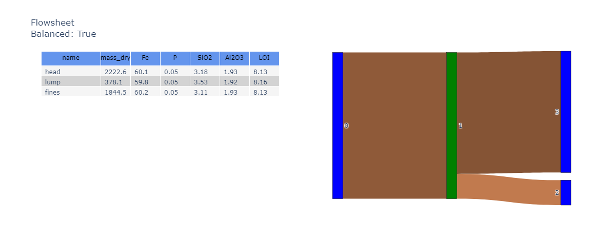

# MassComposition

[](https://github.com/Elphick/mass-composition/actions/workflows/build_and_test.yml)
[](https://github.com/Elphick/mass-composition/actions/workflows/docs_to_gh_pages.yml)

MassComposition is a python package that allows Geo-scientists and Metallurgists to easily work with, and visualise
mass-compositional data.

Mass Composition in this context is just that - Mass *and* Composition.  It is not Compositional Data Analysis (CoDa), 
since here we care more about mathematical operations like weight averaging and technically correct mathematical 
operations.  Of course, we also need to manage moisture correctly - chemical composition is reported on a dry basis 
and moisture on a wet basis.

The package not only supports individual MassComposition objects, but collections of objects that are 
mathematically related in a Directional Graph (Network or flowsheet).

## Prerequisites

Before you begin, ensure you have met the following requirements:
* You have installed the latest version of the mass-composition python package.
* You have a Windows/Linux/Mac machine.
* You have read the [docs](https://elphick.github.io/mass-composition).

## Installing MassComposition

To install MassComposition, follow these steps:

```
pip install mass-composition -e .[viz,network]
```

Or, if poetry is more your flavour.

```
poetry add "mass-composition[viz,network]"
```

## Using MassComposition

To use MassComposition, follow these steps:

There are some basic requirements that the incoming DataFrame must meet.  We'll use a sample DataFrame here.

```python    
df_data: pd.DataFrame = sample_data()
```

Create the object

```python
obj_mc: MassComposition = MassComposition(df_data)
```

It is then trivial to calculate the weight average aggregate of the dataset.

```python
obj_mc.aggregate()
```

Multiple composition analytes can be viewed in a single interactive parallel coordinates plot.

```python
obj_mc: MassComposition = MassComposition(df_data.reset_index().set_index(['DHID', 'interval_from', 'interval_to']),
                                          name=name)

fig: Figure = obj_mc.plot_parallel(color='Fe')
fig
```


Network visualisations are and other plots are interactive (click on the image).

[](./docs/source/_static/example_plot.html)


For full examples, see the [gallery](/auto_examples/index).

## Contributing to MassComposition

To contribute to MassComposition, follow these steps:

1. Fork this repository.
2. Create a branch: `git checkout -b <branch_name>`.
3. Make your changes and commit them: `git commit -m '<commit_message>'`
4. Push to the original branch: `git push origin mass-composition`
5. Create the pull request.

Alternatively see the GitHub documentation on [creating a pull request](https://help.github.com/en/github/collaborating-with-issues-and-pull-requests/creating-a-pull-request).

## Contributors

This project is still in its infancy, but I'm keen to work with contributors.

## Contact

If you want to contact me you can reach me at <your_email@address.com>.

## License

This project uses the following license: [MIT](/license/license).

